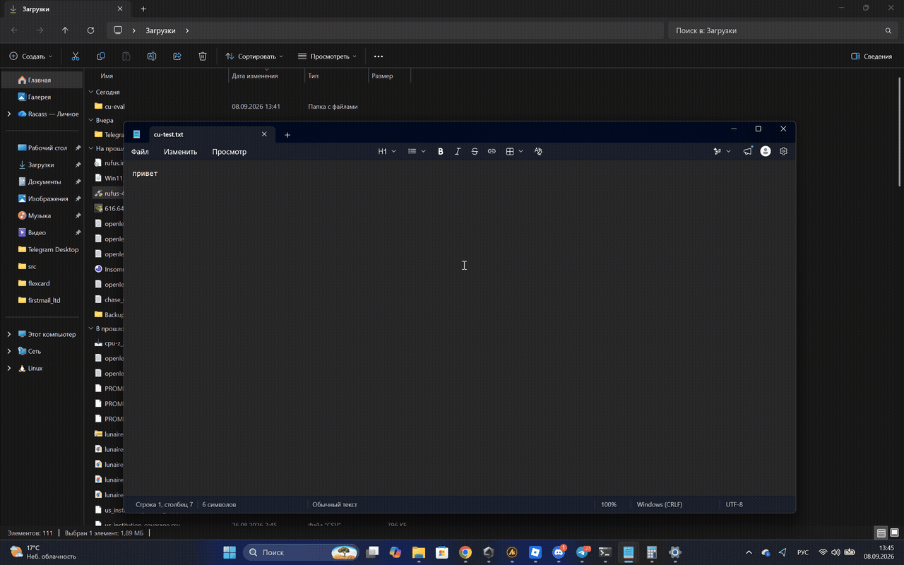

[English version](README.md)

# Claude Computer Use

Плагин для Claude Code, дающий Claude полный контроль над рабочим столом Windows — мышь, клавиатура, окна, перетаскивание, несколько мониторов — на скорости, близкой к человеческой. Пока Claude управляет, активный монитор обрамляется светящейся рамкой с HUD-панелью. Нажмите **Esc Esc**, чтобы мгновенно забрать управление; нажмите ещё раз, чтобы вернуть.



## Возможности

- **Полное управление мышью и клавиатурой** — клик, перетаскивание, прокрутка, набор текста (Unicode), горячие клавиши
- **Скриншот после каждого действия** — модель видит результат каждого шага
- **UI Automation `find`** — находите кнопки, поля ввода, пункты меню по имени или роли вместо угадывания пикселей
- **Поддержка нескольких мониторов** — переключение между мониторами, per-monitor DPI v2
- **Светящийся оверлей + HUD** — рамка цвета акцента с эффектом «дыхания», заголовок задачи, лента действий, пульсация при клике
- **Мгновенная остановка** — Esc Esc забирает управление; опционально пауза при любом физическом вводе (`auto_pause: true`)
- **Плавное движение мыши** — естественное перемещение курсора между точками
- **Рецепты** — процедурная память: Claude запоминает повторяющиеся задачи и воспроизводит их за один вызов
- **Агент-оператор** на Sonnet с выбором модели на задачу (Opus для сложных решений, Haiku для тривиальных повторов)
- **Чистый Go, без cgo, один бинарный файл** — лицензия MIT

## Установка

Из маркетплейса Claude Code:

```
/plugin marketplace add racass-pixel/claude-computer-use
/plugin install computer-use@claude-computer-use
```

При первом запуске `cu.exe` скачивается из GitHub Releases (с проверкой контрольной суммы). Если релиз недоступен, сборка выполняется через Go, если он установлен.

Для разработки склонируйте репозиторий и запустите Claude Code:

```
claude --plugin-dir C:\path\to\claude-computer-use
```

## Разрешения

В режиме bypass настройка не нужна. Иначе добавьте в настройки Claude Code:

```json
{
  "permissions": {
    "allow": ["mcp__plugin_computer-use_desktop"]
  }
}
```

## Использование

Попросите Claude выполнить что-нибудь на рабочем столе:

> Открой Блокнот, напиши «Привет, мир!» и сохрани на Рабочий стол как hello.txt

> В Проводнике перетащи report.pdf из Загрузок в папку Проекты

> Открой Chrome, перейди на github.com/settings/profile и измени био на «Строю вещи»

Claude разбивает задачу на подзадачи, запускает агента-оператора, показывает оверлей и сообщает результат.

### Как забрать управление

Нажмите **Esc Esc** в любой момент. Claude немедленно остановится, оверлей станет серым. Первый Esc попадает в активное приложение (может закрыть меню или диалог) — если это мешает, задайте `hotkey` как `ctrl+alt+esc` в конфигурации — такая комбинация полностью перехватывается.

### Как вернуть управление

Нажмите **Esc Esc** снова или просто отправьте следующее сообщение — управление возобновится автоматически.

### Автоматическая пауза при физическом вводе

По умолчанию только Esc Esc забирает управление. Установите `auto_pause: true` в конфигурации, чтобы пауза срабатывала и при движении мыши (с порогом) или нажатии любой клавиши.

## Инструменты

Плагин предоставляет 18 MCP-инструментов через сервер `desktop`:

| Инструмент | Назначение | Основные аргументы |
|---|---|---|
| `screenshot` | Захват экрана (активный монитор, конкретный монитор или область) | `monitor`, `region`, `scale`, `format` |
| `monitors` | Список мониторов с координатами, DPI, позицией курсора и активного окна | — |
| `click` | Клик по x,y или по элементу из `find` | `x`, `y`, `element`, `button`, `count`, `modifiers` |
| `move` | Переместить мышь (навести) | `x`, `y`, `element` |
| `drag` | Перетащить из одной точки в другую | `from`, `to`, `button`, `duration_ms` |
| `scroll` | Прокрутка колёсиком | `x`, `y`, `dy`, `dx` |
| `type` | Набор текста в активный элемент (Unicode) | `text`, `mode` |
| `key` | Нажать аккорд или последовательность аккордов | `keys` (`"ctrl+s"` или `["win+r","enter"]`) |
| `clipboard` | Чтение или запись текстового буфера обмена | `action` (`get`/`set`), `text` |
| `windows` | Список открытых окон верхнего уровня | `filter` (регулярное выражение) |
| `window` | Фокус, свернуть, развернуть, восстановить, закрыть, переместить, изменить размер | `action`, `target` |
| `find` | Найти элементы интерфейса по имени/роли через UI Automation | `query`, `role`, `window`, `limit` |
| `wait` | Ожидание: пауза, появление окна, стабилизация экрана | `ms`, `window`, `stable`, `timeout_ms` |
| `pixel` | Прочитать цвет одного или нескольких пикселей (для калибровки визуальных подсказок) | `x`, `y`, `points` |
| `click_until` | Кликать повторно, пока пиксель-зонд не совпадёт (или перестанет совпадать) с цветом | `x`, `y`, `probe`, `color`, `max`, `interval_ms` |
| `batch` | Выполнить несколько действий подряд, один скриншот в конце | `actions` |
| `control` | Управление сессией: статус, показать оверлей, скрыть, задать заголовок HUD | `action` |
| `recipe` | Процедурная память: search, run, save, trace, get, list, delete | `action`, `slug`, `values`, `query` |

Все координаты — пиксели **последнего скриншота**. Сервер преобразует их в экранные координаты; модель никогда не выполняет арифметику координат.

### Прогон повторяющихся списков

Когда Claude должен обработать множество одинаковых строк (принять/отклонить, отметить/снять), `click_until` кликает в одну точку на стороне сервера, пока пиксель-зонд не примет целевой цвет — например, нажимать «Отклонить» на верхней строке, пока 5-я звезда следующего заявителя не станет жёлтой. В сочетании с `pixel` (узнать цвет подсказки) и `screenshot_region` (держать зум на рабочей области) это заменяет один клик за ход модели на десятки кликов за один вызов инструмента.

## Конфигурация

Файл: `%APPDATA%\claude-computer-use\config.json`

Каждый параметр можно задать через переменную окружения (префикс `CU_`, верхний регистр, подчёркивания):

| Параметр | По умолчанию | Переменная | Описание |
|---|---|---|---|
| `hotkey` | `esc esc` | `CU_HOTKEY` | Комбинация для переключения управления (поддерживаются аккорды, например `ctrl+alt+esc`) |
| `auto_pause` | `false` | `CU_AUTO_PAUSE` | Пауза при любом физическом вводе (мышь/клавиатура) |
| `mouse_threshold_px` | `12` | `CU_MOUSE_THRESHOLD_PX` | Минимальное перемещение мыши (пикс.) для срабатывания авто-паузы |
| `mouse_glide_ms` | `220` | `CU_MOUSE_GLIDE_MS` | Длительность плавного перемещения курсора (0 = мгновенно) |
| `screenshot_long_edge` | `1366` | `CU_SCREENSHOT_LONG_EDGE` | Автомасштабирование: длинная сторона скриншота не превышает это значение |
| `screenshot_format` | `png` | `CU_SCREENSHOT_FORMAT` | Формат скриншота: `png` или `jpeg` |
| `jpeg_quality` | `85` | `CU_JPEG_QUALITY` | Качество JPEG (1–100) |
| `lang` | `auto` | `CU_LANG` | Язык HUD и оверлея: `auto`, `en` или `ru` |
| `accent` | `#D97757` | `CU_ACCENT` | Цвет акцента оверлея (`#RRGGBB`) |
| `overlay` | `true` | `CU_OVERLAY` | Показывать оверлей при управлении |
| `border_thickness` | `56` | `CU_BORDER_THICKNESS` | Толщина полосы рамки оверлея в пикселях (до DPI) |
| `border_intensity` | `0.85` | `CU_BORDER_INTENSITY` | Непрозрачность рамки оверлея (0.0–1.0) |
| `idle_release_ms` | `120000` | `CU_IDLE_RELEASE_MS` | Скрыть оверлей после стольких мс бездействия |
| `pause_wait_ms` | `20000` | `CU_PAUSE_WAIT_MS` | Сколько мс действие ждёт возврата управления перед ошибкой |
| `paste_threshold` | `200` | `CU_PASTE_THRESHOLD` | Порог символов, выше которого `type` использует вставку через буфер обмена |
| `log_file` | *(пусто)* | `CU_LOG_FILE` | Путь к файлу журнала (пусто = только stderr) |

## Как это работает

```
Claude Code (основная сессия = оркестратор)
 │  навык computer-use: разбивка, выбор модели, проверка
 │  Agent(operator, model: sonnet|opus|haiku) ── цикл действий
 │          │ MCP-инструменты: mcp__plugin_computer-use_desktop__*
 ▼          ▼
cu.exe serve  (MCP-сервер stdio, живёт всю сессию)
 ├─ server    — инструменты, batch, wait, преобразование координат
 ├─ input     — SendInput: мышь, клавиатура, буфер обмена
 ├─ screen    — мониторы, DPI, захват BitBlt, масштабирование, PNG/JPEG
 ├─ window    — перечисление / фокус / перемещение / закрытие окон
 ├─ uia       — UI Automation: поиск элементов по имени/роли
 ├─ overlay   — светящаяся рамка, HUD, пульсация (отдельный UI-поток)
 ├─ guard     — низкоуровневые хуки ввода, Esc Esc, автомат состояний паузы
 ├─ recipes   — сохранение/поиск/воспроизведение параметризованных последовательностей
 └─ config    — JSON-файл + переменные окружения CU_*
```

Сервер хранит **вид** (монитор, смещение, масштаб), обновляемый каждым `screenshot`. Все x,y в аргументах инструментов — пиксели изображения последнего скриншота. Сервер преобразует их в физические экранные координаты через матрицу вида. Автомасштабирование ограничивает длинную сторону до 1366 пикселей (настраивается), что даёт около 1400 токенов изображения на скриншот.

## Рецепты

Рецепты — это процедурная память: сохранённые последовательности действий на рабочем столе, которые Claude может воспроизводить без скриншотов между шагами.

**Как это работает:**
1. Перед многошаговой работой оркестратор ищет существующий рецепт: `recipe{action:"search", query:"..."}`.
2. Если найдено совпадение, оператор воспроизводит его: `recipe{action:"run", slug:"...", values:{...}}` — и проверяет результат.
3. После успешной новой задачи Claude формирует рецепт из трассировки действий: `recipe{action:"save", ...}`, используя `{{параметр}}` для переменных частей.

Рецепты хранятся как JSON-файлы в `%APPDATA%\claude-computer-use\recipes\`. Используйте `recipe{action:"list"}` для просмотра и `recipe{action:"delete", slug:"..."}` для удаления.

## Ограничения

- **Привилегированные окна**: Claude не может отправлять ввод в окна с правами администратора и диалоги UAC, пока `cu.exe` не запущен с повышенными привилегиями.
- **Эксклюзивный полноэкранный режим**: оверлей не виден в играх с исключительным полноэкранным режимом; низкоуровневые хуки продолжают работать.
- **SetForegroundWindow**: Windows ограничивает перехват фокуса; применяются стандартные обходные решения, но изредка окно лишь мигает на панели задач.
- **Первый Esc**: первый Esc из Esc Esc попадает в приложение (может закрыть меню); задайте `hotkey` как `ctrl+alt+esc`, чтобы избежать этого.
- **Без bypass-режима**: каждый вызов инструмента запрашивает разрешение, если не добавлено правило allow выше.
- **Только Windows**: macOS и Linux пока не поддерживаются; весь платформенный код скрыт за интерфейсами для будущих портов.

## Разработка

Сборка:

```
go build ./cmd/cu
```

Тесты:

```
go test ./...
```

Vet (для контрибьюторов — проверка `unsafeptr` отключена из-за паттернов вызовов Win32):

```
go vet -unsafeptr=false ./...
```

Проверка форматирования:

```
gofmt -l .
```

Кросс-компиляция (проверяет отсутствие случайного Windows-only кода в общих пакетах):

```
GOOS=linux go build ./...
```

CLI-утилиты:

```
cu doctor                        # мониторы, DPI, скорость захвата, UIA, конфигурация, рецепты
cu demo                          # показать оверлей на 5 секунд
cu screenshot -o screen.png      # сохранить скриншот
cu input click 500 300           # отправить клик
cu input type "привет"           # набрать текст
```

Релиз:

```
git tag v0.1.0
git push --tags
```

GitHub Actions соберёт и опубликует релиз через GoReleaser.

### Предупреждение для разработчиков

Если запустить Claude Code с рабочей директорией внутри этого репозитория, `.mcp.json` загружается ещё и как проектный сервер `desktop`, в котором `${CLAUDE_PLUGIN_ROOT}` не раскрывается. Этот дубликат падает с CONNECTION_CLOSED — игнорируйте его или запускайте Claude Code из другой директории. Сервер самого плагина — `plugin-computer-use-desktop`.

## Лицензия

[MIT](LICENSE)
